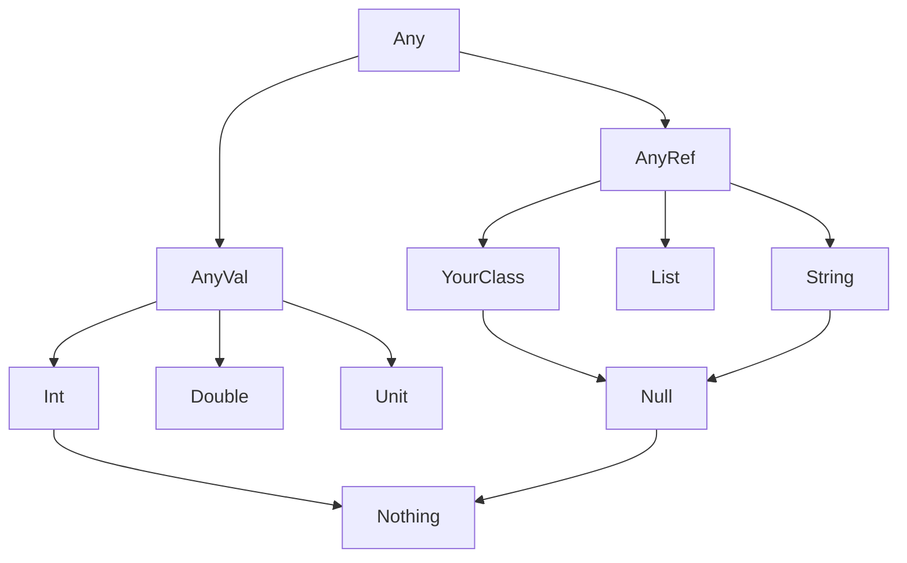

# Variables and Types

## Declaring Values and Variables

```scala
val x = 42          // immutable, type inferred as Int
val y: Double = 3.14 // explicit type annotation
var z = "hello"      // mutable
z = "world"          // ok, z is var
// x = 99            // ERROR: val cannot be reassigned
```

### Declarations Breakdown

- **`val x = 42`**: The `val` keyword declares an immutable value. Once assigned, it can never be changed. Notice we did not declare a type; the compiler infers `x` is an `Int`.
- **`val y: Double =`**: If you want to be explicit, or force a specific type, you add `: Type` after the variable name.
- **`var z =`**: The `var` keyword declares a mutable variable. This means `z` can be reassigned later in the code.

> [!tip] Prefer `val` over `var`
> Scala encourages immutability. Use `val` by default and only reach for `var` when you have a clear reason.

## Basic Types

All types in Scala are objects. There are no "primitives" at the language level like `int` or `double` in Java (though Scala invisibly turns them into fast JVM primitives under the hood to maximize speed).

| Type | Size | Range / Description |
| --- | --- | --- |
| `Byte` | 8-bit | -128 to 127 |
| `Short` | 16-bit | -32768 to 32767 |
| `Int` | 32-bit | -2^31 to 2^31-1 |
| `Long` | 64-bit | -2^63 to 2^63-1 |
| `Float` | 32-bit | IEEE 754 single precision |
| `Double` | 64-bit | IEEE 754 double precision |
| `Char` | 16-bit | Unicode character |
| `Boolean` | | `true` or `false` |
| `String` | | Sequence of `Char`, backed by `java.lang.String` |
| `Unit` | | Like `void`, the "no value" type |
| `Nothing` | | Bottom type, subtype of everything |
| `Null` | | Subtype of all reference types |
| `Any` | | Top of the type hierarchy |
| `AnyVal` | | Parent of all value types |
| `AnyRef` | | Parent of all reference types (alias for `java.lang.Object`) |

## Type Hierarchy



Everything traces back to `Any`.

- **`AnyVal`**: Value types (like numbers) that live natively in memory for speed.
- **`AnyRef`**: Reference types (like Classes and Lists) that are stored as pointers.
- **`Nothing`**: The literal bottom of the hierarchy. If a function returns `Nothing`, it means the function never actually returns normally (it crashes or throws an exception).

## Literals

```scala
val dec = 42          // Int
val long = 42L        // Long
val float = 3.14f     // Float
val double = 3.14     // Double
val hex = 0xFF        // Int (255)
val char = 'A'        // Char (single quotes)
val str = "hello"     // String (double quotes)
val multi = """line 1
               |line 2""".stripMargin  // multiline String
val bool = true       // Boolean
val unit = ()         // Unit
```

### Literals Breakdown

- **`42L` / `3.14f`**: Appending `L` forces the number to be a 64-bit Long instead of a 32-bit Int. Adding `f` forces it to be a Float instead of a Double.
- **`'A'` vs `"hello"`**: Single quotes denote exactly one character. Double quotes denote a String.
- **`"""..."""`**: Triple-quotes allow you to write strings that span multiple lines. The `.stripMargin` function trims away all the visual whitespace on the left side up to the `|` symbol.
- **`()`**: Empty parentheses literally represent the `Unit` value.

## String Interpolation

```scala
val name = "Scala"
val version = 3

// s-interpolator: variable substitution
println(s"Hello $name $version")        // Hello Scala 3
println(s"1 + 1 = ${1 + 1}")           // 1 + 1 = 2

// f-interpolator: printf-style formatting
println(f"Pi is $3.14159%.2f")          // Pi is 3.14

// raw-interpolator: no escaping
println(raw"No escape: \n stays")       // No escape: \n stays
```

### Interpolation Breakdown

- **`s"..."`**: Placing an `s` before quotes enables interpolation. You can inject variables directly using `$variable`.
- **`${1 + 1}`**: By wrapping in curly braces `${}`, you can compute complex math or run functions directly inside the string!
- **`f"..."`**: The `f` interpolator allows C-style formatting. `%.2f` says "Force this number to show exactly 2 decimal places."
- **`raw"..."`**: Ignores escape characters like `\n` or `\t`, printing them literally.

## Type Inference

Scala has powerful type inference. You usually don't need to annotate types!

```scala
val xs = List(1, 2, 3)          // List[Int]
val map = Map("a" -> 1)         // Map[String, Int]
def add(a: Int, b: Int) = a + b // return type Int inferred
```

### Inference Breakdown

- **`List(1, 2, 3)`**: You didn't tell Scala it was a List of Integers. But because the numbers inside are ints, the compiler infers `List[Int]`.

> [!note] When to annotate types
>
> - Public API method return types (good practice)
> - When the compiler can't infer (recursive methods, overloaded methods)
> - When you want to be explicit for readability

## Type Casting

Sometimes you have to force a type to fit into another type.

```scala
val x: Long = 42.toLong
val s: String = x.toString

// asInstanceOf for reference types (unsafe, avoid when possible)
val obj: Any = "hello"
val str = obj.asInstanceOf[String]

// isInstanceOf for type checking
if obj.isInstanceOf[String] then println("it's a string")

// Prefer pattern matching instead:
obj match
  case s: String => println(s"String: $s")
  case i: Int    => println(s"Int: $i")
```

### Casting Breakdown

- **`.toLong` / `.toString`**: The safest way to change types. These are built-in methods designed explicitly for converting data safely.
- **`.asInstanceOf[String]`**: This literally forces the compiler to treat `obj` as a String. If `obj` is actually a Number, the program will crash with a `ClassCastException`. Avoid this!
- **`match case s: String`**: This is the functional, ultra-safe way to verify and cast a type at runtime without risk of crashing. See [[Pattern Matching]].

## Tuples

Tuples are quick, unnamed ways to group multiple pieces of data together.

```scala
val pair = (1, "hello")         // (Int, String)
val triple = (1, "hello", true) // (Int, String, Boolean)

// Access by position (1-indexed)
pair._1  // 1
pair._2  // "hello"

// Destructuring
val (num, text) = pair
println(num)   // 1
println(text)  // "hello"
```

### Tuples Breakdown

- **`(1, "hello")`**: Wrapping comma-separated values in parentheses creates a Tuple. Unlike lists, tuples can contain mixed data types.
- **`._1`**: You can pull data out of a Tuple using its index number. Warning: Tuples use 1-based indexing! `._1` is the first element, not the second.
- **`val (num, text) =`**: The cleanest way to pull data out consists of "destructuring" the tuple directly into named variables.

## See Also

- [[Keywords]]
- [[Functions]]
- [[Collections Overview]]

**Tags:** #scala #types #basics
